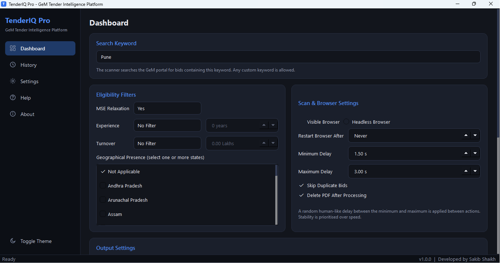
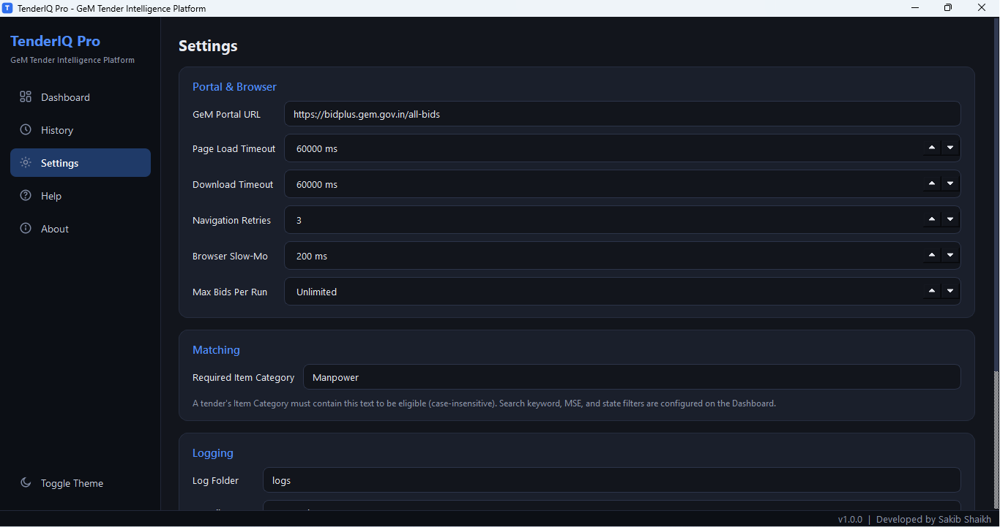
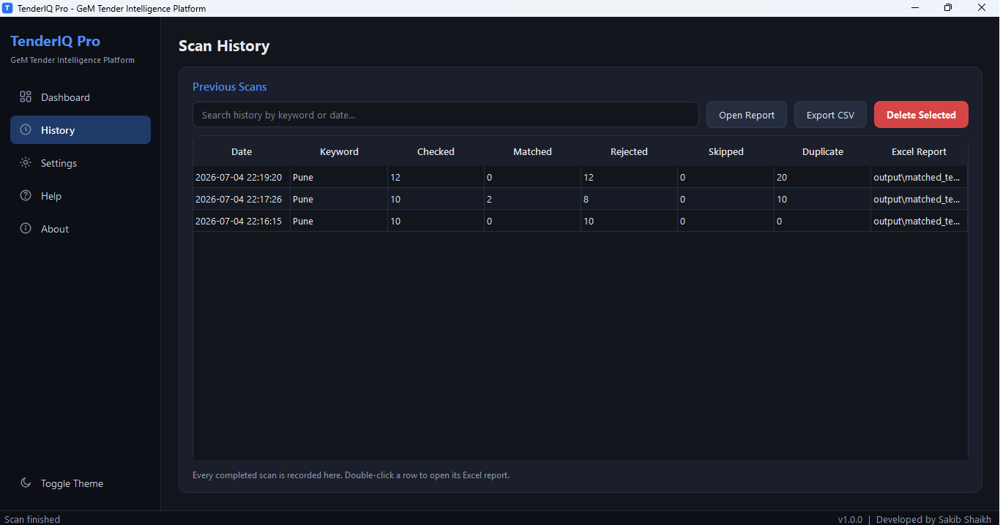
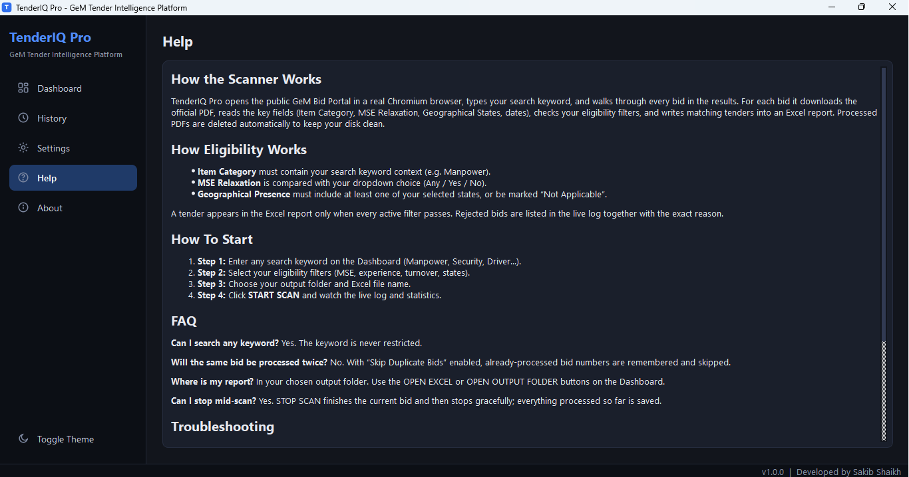
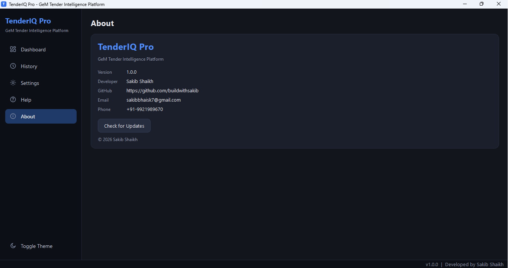

# TenderIQ Pro

**Automated GeM Bid Scanner with a Modern Desktop UI**

TenderIQ Pro scans the [Government e-Marketplace (GeM)](https://bidplus.gem.gov.in/all-bids) for manpower tenders, downloads and reads every bid PDF, validates them against user‑configurable rules, and exports a clean Excel report – all through an intuitive PySide6 interface.  
A headless `main.py` script is also included for server/automation use.

<p align="center">
  
  
  
</p>

---

## Features

- 🖥️ **Desktop Application** – Built with PySide6, featuring a dashboard, history, settings, and theme support (light/dark).
- 🔍 **Automated Tender Scanning** – Searches GeM for a user-defined keyword, downloads tender PDFs, validates them against configurable rules, and processes them automatically.
- 📄 **PDF Data Extraction** – Automatically extracts Bid Number, Dates, Contract Period, Address, Item Category, MSE Relaxation, and other required information from GeM tender PDFs.
- ✅ **Smart Filtering** – Three configurable rules decide if a tender qualifies (item category, MSE relaxation, allowed states).
- 📊 **Excel Export** – Only matched tenders are written to `output/matched_tenders.xlsx`.
- 🧹 **Automatic Cleanup** – Downloaded PDFs are deleted after processing to keep the workspace clean.
- 📈 **History & Statistics** – All scan results are stored in a local SQLite database and can be reviewed on the History page.
- ⚙️ **Configurable** – All filtering criteria and timeouts are adjustable via the Settings page (or `config.json`).
- 🔄 **Duplicate Prevention** – Already‑processed bid numbers are tracked in `processed_bids.json`.
- 📝 **Detailed Logging** – Every action is logged to the console and to `logs/scanner.log`.
- 🆙 **Built‑in Updater** – Checks for new releases on GitHub and can download updates.
- 🧰 **Headless Mode** – Run the scanner without the UI using `python main.py` (ideal for scheduled tasks).

---

---

## Screenshots

<p align="center">
  
  
</p>

<p align="center">
  
  
</p>


<p align="center">
  
  <!--  -->
</p>

---

## Validation Rules

A tender appears in the final Excel report **only if all three conditions are met**:

| # | Field                                                       | Required Value                            |
|---|-------------------------------------------------------------|-------------------------------------------|
| 1 | Item Category                                               | Contains “Manpower”                       |
| 2 | MSE Relaxation for Years Of Experience and Turnover         | Equals “Yes”                              |
| 3 | Name of States / UT for geographical presence is required   | “Maharashtra” **or** “Not Applicable”     |

These values can be changed under **Settings** in the desktop app or directly in `config.json`.

---
## Output Report Format

Matched tenders are exported to an Excel file (`matched_tenders.xlsx`) with the following columns:

| Sr No | Bid Number         | Dated      | Bid End Date        | Contract Period    | Address                               | Eligible |
|------:|--------------------|------------|---------------------|--------------------|---------------------------------------|----------|
| 1     | GEM/2026/B/7647239 | 02-07-2026 | 13-07-2026 17:00:00 | 1 Year(s) 1 Day(s) | Director,Government Department,Mumbai | Yes      |
| 2     | GEM/2026/B/7647512 | 03-07-2026 | 14-07-2026 18:00:00 | 2 Year(s)          | Municipal Corporation, Pune           | Yes      |
| 3     | GEM/2026/B/7647824 | 04-07-2026 | 15-07-2026 16:30:00 | 6 Month(s)         | Public Works Department, Nagpur       | Yes      |

> **Note:** The above records are sample data for demonstration purposes only. Actual results depend on the bids available on the GeM portal and your configured matching criteria.
---

## Installation

1. Clone the repository:

```bash
git clone https://github.com/buildwithsakib/TenderIQ-Pro.git
cd TenderIQ-Pro
```

2. a)Run the setup script (This is for Windows):

```bash
setup.bat
```
  b) (For Mac Users) :

```bash
setup.sh
```

The script automatically:
- Creates a virtual environment
- Installs all required dependencies
- Installs Playwright browsers
---

### Prerequisites

- Python **3.10** or later
- Internet connection (GeM portal must be reachable)
- Windows, macOS, or Linux with a graphical environment (the desktop app requires a display; headless mode does not)

---
## Built With

- Python 3.10+
- PySide6
- Playwright
- SQLite
- OpenPyXL
- pdfplumber

---
